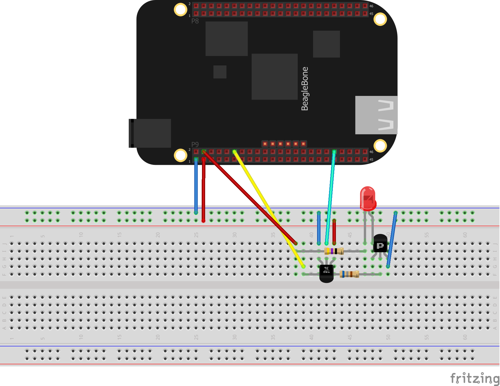

# BBB-heat-circuit

## Description 
The goal of this project is to create a heat circuit using the BeagleBone Black that can be toggled on and off remotely using RESTful APIs. The BeagleBone can only deliver about 3.3V @ 6mA from its GPIO pins.

 So, using Ohm's law, we know that the maximum resistance R = V/I so 3.3 / 0.006 = 550 Ohms. This will also only put out about a 20th of a watt of power so it won't be the greatest heater. And really, you'll want to go lower than the maximum to avoid damaging things. so closer to 4-5 mA would be safer.

A better design would be to use an external power source and use a transistor or MOSFET to drive the heating source. 

---

## Schematics

---

## Required Hardware
* BeagleBone Black with Ethernet or WiFi enabled
* 47 Ohm Resistor
* 680 Ohm Resistor
* TMP36 Temperature Sensor
* BC550 Transistor
* 5mm LED Diode
* Jumper Wires

---

## BeagleBone Circuit

---

## API Documentation
Path: /api/temp

> Sends temperature value in Fahrenheit

Path: /api/heat/off

> Force heat off

Path: /api/heat/on

> Force heat on

---

## Demonstration

